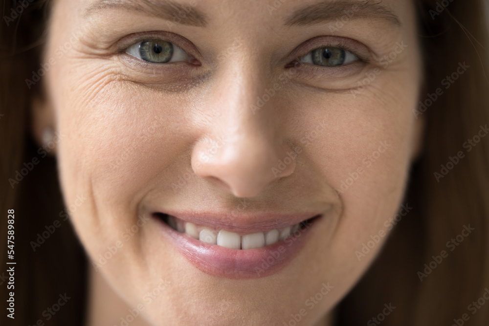

# RTSD: Real-Time Smile Detector

<a target="_blank" href="https://colab.research.google.com/drive/14QfCaIClnfSmHjjVkMNoMtZ0MlRhCwr6?usp=sharing">
  
</a>


The Real-Time Smile Detector (RTSD) is a deep learning model designed to predict the likelihood of a smile in real-time. The model is implemented in PyTorch and is based on a MobileNetV3 backbone architecture. Given an input face image, the RTSD outputs a smile score, representing the confidence of the model that the face is smiling. The model has been trained on the CelebA dataset, which provides a large and balanced set of high-quality images of smiling and non-smiling faces. This dataset was selected for its ease of access and the high quality of the labeled images. The RTSD is capable of providing real-time smile predictions, making it an ideal solution for a wide range of applications.  


## Installation
I recommend to use a new virtual environment and install the following packages:

```bash
# Install pytorch for CUDA 11.7 from pip
pip3 install torch torchvision torchaudio --extra-index-url https://download.pytorch.org/whl/cu117
```
or alternatively if you are using conda

```bash
# Install pytorch for CUDA 11.7 from conda
conda install pytorch torchvision torchaudio pytorch-cuda=11.7 -c pytorch -c nvidia
```

then you install the albumentations package for data augmentation, torchmetrics and wand to log the project.
```bash
pip install albumentations
pip install torchmetrics
pip install wandb
```

## Usage
### Train
You can train the model using the following command:
```bash
python train.py --batch <BATCH_SIZE> -e <EPOCHS> --patience <EARLYSTOPPING PATIENCE> --mode <prod or dev> --dataset <ROOT_PATH> --logging <OPTIONAL> --augment <OPTIONAL>
```
With argumetns:
```python
parser.add_argument('-b', '--batch', type=int, help='Batch Size', default=256)
parser.add_argument('-e', '--epochs', type=int, help='Number of Epochs', default=100)
parser.add_argument('-w', '--workers', type=int, help='Workers for datalaoder', default=2)
# 0 or default for no early stopping
parser.add_argument('-p', '--patience', type=int, help='Number of patience for early stopping', default=0)
parser.add_argument('-d', '--dataset', type=str, help='Root path to dataset', default='dataset')
# Train Data
parser.add_argument('-m', '--mode', type=str, help='dev = train; prod = train + val', default='dev')

# Freeze 2 last layers of pretrained model
# By default you retrain the whole network
parser.add_argument('--freeze', action='store_true', help='Finetune')
parser.set_defaults(freeze=False)

parser.add_argument('--logging', action='store_true', help='Log info wandb')
parser.set_defaults(logging=False)

# Highly recommended to make it robust
# to low resolution images or distance
# and different light conditions
parser.add_argument('--augment', action='store_true', help='Enable data augmentation')
parser.set_defaults(augment=False)
```

### Inference
You can test the model using the following command:
```bash
python test.py -w <.pt file> -i <image1.jpg image2.jpg ...... imageN.jpg> 
```
or test performance on provided test images running default test:
```bash
python test.py -w <.pt file>
```

With argumetns:
```python
parser.add_argument('-w', '--weights', type=str, help='Path to trained weights',
                    default='best_smile.pt')

parser.add_argument('-i', '--input', nargs='+', help='Sample input image path',
                    default=['test_images/test_input.jpg','test_images/test_input_2.jpg','test_images/test_input_3.jpg',
                             'test_images/test_input_4.jpg','test_images/test_input_5.jpg'])
```

## Downloads
You can download the pretrained weights [here](https://drive.google.com/file/d/1dNrr6JQhIaYoFGO0kKuZbj28h6Hn3mLZ/view?usp=share_link).


## Results

Smile Score: 0.9997 |  Smile Score: 0.9995 (Blurry) | Smile Score: 0.9995 (Low Res.)
:-------------------------:|:-------------------------:|:-------------------------:
 |   | 
Smile Score: 0.9706 |  Smile Score: 0.0024 |  Smile Score: 0.0024
 |  | 
